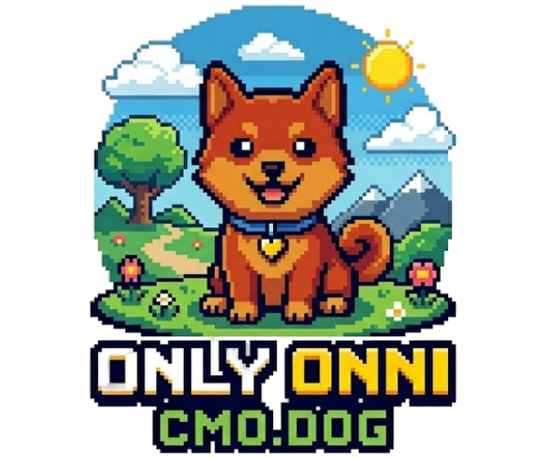

<p align="center">
  
</p>

<h1 align="center">CMO.dog</h1>

<p align="center">
  <strong>Drop in a URL. Onni fetches your Chief Marketing Officer.</strong>
  <br />
  A good Finnish dog who audits your site, maps your competitors, and finds your brand voice — in seconds.
</p>

<p align="center">
  <a href="https://backboard.io"></a>
  
  
  
  
</p>

---

## Who is Onni?

Onni is a Finnish dog. In Finnish, *onni* means **luck** — and that's what he brings your marketing.

Hiring a CMO costs $200k/year. Good ones take months to ramp up.

**Onni does it in 60 seconds.**

Type in any URL. Four AI agents fire up in parallel — they read your site, search the web, and hand back:

- A **site audit** with real scores (performance, SEO, accessibility, best practices)
- A **competitor landscape** with categories and pricing
- A **brand voice profile** so your copy sounds like *you*
- A ranked list of **SEO fixes** with step-by-step instructions
- An **AI chat** interface so you can keep drilling into next steps

No prompt engineering. No setup. Just a URL.

---

## Demo

> Type a URL → watch Onni run → read your marketing brief

```
> Checking what content and documents you have...
> Content and documents summarized.
> Now let me check out your competition...
> Searching: yoursite.com competitors alternative
> Evaluating competitor positioning strategy...
> Competitor analysis complete.
> Now let me figure out your brand voice...
> Brand voice guide ready
> Running website audit...
> Scanning page structure and metadata...
> Page speed and core web vitals measured
> Found 7 SEO optimization opportunities (score: 64/100)
```

---

## Features

| | |
|---|---|
| **Website Audit** | Performance, SEO, Accessibility, and Best Practices scores with specific failing checks and how-to-fix guides |
| **Competitor Intel** | Direct vs. secondary competitors with pricing — sourced live from the web |
| **Brand Voice** | 2–3 sentence brand profile your team can actually use |
| **SEO Fix Queue** | Ranked issues (Critical → High → Medium) with numbered remediation steps |
| **AI CMO Chat** | Ask follow-up questions about your audit — Onni remembers context |
| **Live Terminal** | Real-time SSE stream so you see agents working, not a spinner |

---

## Stack

| Layer | Tech |
|---|---|
| AI Agents | [Backboard.io](https://backboard.io) — threads, assistants, web search |
| API | FastAPI + Uvicorn, Server-Sent Events |
| Frontend | Next.js 15, Tailwind CSS, shadcn/ui |
| Runtime | Python 3.11+ via `uv`, Node 18+ |
| Schemas | Pydantic v2 |

---

## Quick Start

### 1. Clone & install

```bash
git clone https://github.com/your-org/cmo.dog.git
cd cmo.dog

# Python deps
uv sync

# Frontend deps
cd web && npm install && cd ..
```

### 2. Configure `.env`

```bash
cp .env.example .env
```

```env
BACKBOARD_API_KEY=your_key_here

# Assistant IDs — created once, reused forever (never delete these)
BACKBOARD_ASSISTANT_CONTENT=asst_...
BACKBOARD_ASSISTANT_COMPETITOR=asst_...
BACKBOARD_ASSISTANT_BRAND=asst_...
BACKBOARD_ASSISTANT_AUDIT=asst_...
```

> Get a free Backboard API key at [backboard.io](https://backboard.io). Create your four assistants once and paste the IDs here.

### 3. Run

```bash
./start.sh
```

API → `http://localhost:8000`  
App → `http://localhost:3000`

---

## How It Works

```
User enters URL
      │
      ▼
 FastAPI /runs  ──────────────────────────────────────────────┐
      │                                                        │
      │  SSE stream → browser terminal                        │
      ▼                                                        │
┌─────────────────────────────────────────────────────────┐   │
│                  Orchestrator Pipeline                  │   │
│                                                         │   │
│  1. Content Agent    → summarize site + docs            │   │
│  2. Competitor Agent → find rivals, pricing             │   │
│  3. Brand Agent      → extract voice & tone             │   │
│  4. Audit Agent      → scores + SEO checks + fixes      │   │
└─────────────────────────────────────────────────────────┘   │
      │                                                        │
      └──────────────── RunStatus (Pydantic) ─────────────────┘
                             │
                     GET /runs/{id}
                             │
                      Next.js dashboard
                  (audit · competitors · chat)
```

Each agent is a [Backboard](https://backboard.io) assistant with live web search enabled — no stale training data, no hallucinated competitors.

---

## Project Structure

```
cmo.dog/
├── app/
│   ├── main.py          # FastAPI routes + SSE
│   ├── orchestrator.py  # Agent pipeline
│   └── schemas.py       # Pydantic models
├── web/
│   ├── src/app/         # Next.js pages
│   └── src/components/  # UI components
├── assets/
│   └── onni.png         # The dog himself
├── scripts/             # Smoke tests
├── pyproject.toml       # uv/hatch config
└── start.sh             # Clean start script
```

---

## API

```http
POST /runs          body: { website_url }   → { run_id }
GET  /runs/{id}     → RunStatus JSON
GET  /runs/{id}/stream  → SSE terminal lines
POST /runs/{id}/chat    body: { message }   → { reply }
```

---

## Contributing

Pull requests welcome. Keep it surgical — one concern per PR.

- Backend logic lives in `app/` only. No logic in the frontend.
- Pydantic models for all data shapes.
- `uv` for Python deps, `npm` for frontend.
- Never delete Backboard assistants — they carry persistent data.

---

## Built with

- [Backboard.io](https://backboard.io) — AI agent infrastructure
- [FastAPI](https://fastapi.tiangolo.com)
- [Next.js](https://nextjs.org)
- [Tailwind CSS](https://tailwindcss.com)
- [shadcn/ui](https://ui.shadcn.com)

---

<p align="center">
  Made with 🐾 and too many competitor analyses.
  <br />
  <a href="https://cmo.dog">cmo.dog</a> · <a href="https://backboard.io">backboard.io</a>
</p>
